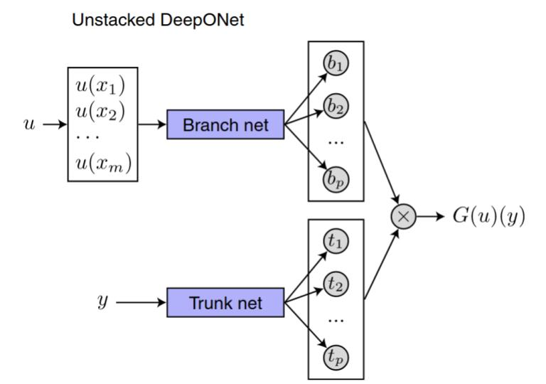

# Deep Learning Final Project

Final project for the course **DEEP LEARNING** (A.Y. 2024–2025, Department of Information Engineering – DEI, Prof. Loris Nanni).

---

## Project Overview

The aim of this project is to analyze the ability of neural networks to approximate **nonlinear operators**, a fundamental problem in scientific machine learning.  
In particular, we focus on **Deep Operator Networks (DeepONets)**, introduced by Lu *et al.* in their work:  

> **Learning nonlinear operators via DeepONet**  
> [Lu, Jin, Pang, Zhang, Karniadakis (2021, Nature Machine Intelligence)](https://www.nature.com/articles/s42256-021-00302-5)

This paper demonstrates the capacity of neural networks, specifically DeepONet, to learn and approximate nonlinear operators, underpinned by the universal approximation theorem.  

The official implementation and related resources can be found on the authors’ GitHub repository:  
🔗 [DeepONet GitHub](https://github.com/lululxvi/deeponet)
---

## Objectives

- Study the **theoretical framework** of operator learning.  
- Reproduce and extend experiments based on DeepONet architectures.  
- Investigate the impact of architectural choices (branch/trunk networks, activation functions, depth/width).  
- Evaluate generalization capability across different function spaces.  

---

## Repository Structure

